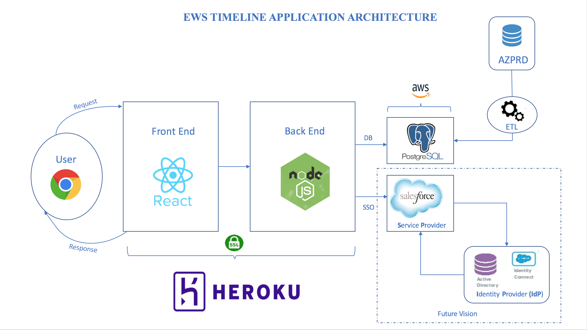

# timeline

# Heroku
http://ewstimeline.herokuapp.com/

# Architecture



# Development

```
npm install
DATALOAD_URL="<HEROKU_POSTGRES_CONNECTION_STRING>" npm run watch
```

# Deployment to Heroku

We have two environments where the code gets deployed

1. Development
   http://ewstimeline-dev.herokuapp.com/

2. Production
   http://ewstimeline.herokuapp.com/

### Configure the remote branches

```
git remote add dev https://git.heroku.com/ewstimeline-dev.git
git remote add prod https://git.heroku.com/ewstimeline.git
```

then your `git remote -v` should look like this

```
dev       https://git.heroku.com/ewstimeline-dev.git (fetch)
dev       https://git.heroku.com/ewstimeline-dev.git (push)
origin    git@git.soma.salesforce.com:<userid>/timeline.git (fetch)
origin    git@git.soma.salesforce.com:<userid>/timeline.git (push)
prod      https://git.heroku.com/ewstimeline.git (fetch)
prod      https://git.heroku.com/ewstimeline.git (push)
```

In order to deploy, you will

* `git push dev master` (to push to `ewstimeline-dev`)
* `git push prod master` (to push to `ewstimeline`)
